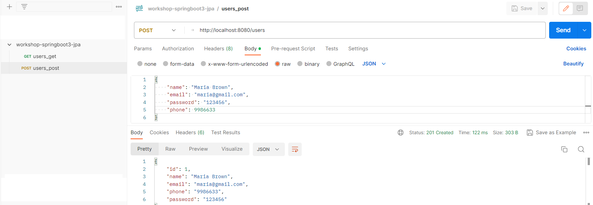
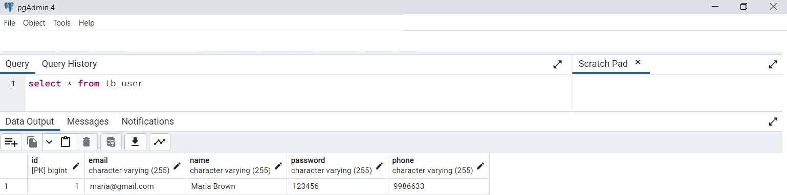

# workshop-springboot3-jpa
Curso Java Completo Springboot JPA

Objetivos 
* Criar projeto Spring Boot Java 
* Implementar modelo de domínio 
* Estruturar camadas lógicas: resource, service, repository 
* Configurar banco de dados de teste (H2) 
* Povoar o banco de dados 
* CRUD - Create, Retrieve, Update, Delete 
* Tratamento de exceções 

## Postman 

## PostgreSQL 

